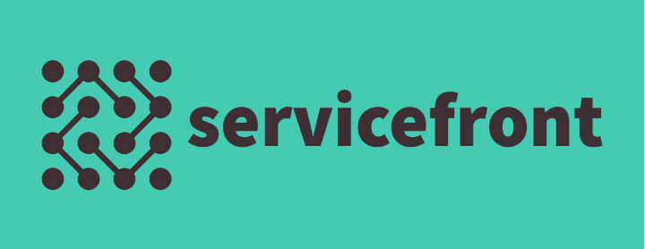

[![Contributors][contributors-shield]][contributors-url]
[![Forks][forks-shield]][forks-url]
[![Stargazers][stars-shield]][stars-url]
[![Issues][issues-shield]][issues-url]
[![MIT License][license-shield]][license-url]
[![LinkedIn][linkedin-shield]][linkedin-url]

<br />
<p align="center">
  <!-- <!-- <a href="https://github.com/egrzeszczak/programowanie-systemow-webowych">
    
  </a> -->
  <a href="https://github.com/egrzeszczak/programowanie-systemow-webowych">
    
  </a> 

  <h2 align="center">Programowanie Systemów Webowych</h3>
  <h3 align="center">System zarządzania usługami IT</h3>

  <p align="center">
    <a href="https://github.com/egrzeszczak/programowanie-systemow-webowych"><strong>Dokumentacja »</strong></a>
    <br />
    <br />
    <a href="https://github.com/egrzeszczak">Demo</a>
    ·
    <a href="https://github.com/egrzeszczak/programowanie-systemow-webowych/issues">Zgłoś problem</a>
  </p>
</p>

## Spis treści

* [Opis projektu](#opis-projektu)
    * [Stack](#stack)
    * [Wybrane moduły](#wybrane-moduly)
      * [Struktura HTML5](#struktura-html5)
      * [Formularz](#formularz)
      * [Web storage](#web-storage)
      * [Drag & Drop](#drag--drop)
      * [Rest API](#rest-api)
      * [Workery](#workery)
* [Uruchomienie](#uruchomienie)
    * [Wymagane środowisko](#wymagane-srodowisko)
    * [Instalacja](#instalacja)
* [Licencja](#licencja)
* [Zrzuty ekranu](#zrzuty-ekranu)
* [Kontakt](#kontakt)

## Opis projektu

Projekt jest warunkiem zaliczenia przedmiotu **Programowanie Systemów Webowych** który jest oparty na wybranych przez studenta funkcjonalnościach poniżej:

* [Struktura HTML5](#struktura-html5)
* [Formularz](#formularz)
* [Web storage](#web-storage)
* [Drag & Drop](#drag--drop)
* [Rest API](#rest-api)
* [Workery](#workery)

### Stack

<p align="left">
    
    
    
    
    
</p>


### Wybrane moduly

#### Struktura HTML5

- &check; ~~Strukutra HTML5 dzięki silnikowi wyświetlania `ejs`~~
- &check; ~~Framework `TailwindCSS` do stylizacji HTML~~

#### Formularz

- &check; ~~Logowanie~~
- &check; ~~Rejestracja~~
- &check; ~~Tworzenie wniosków~~
- &check; ~~Zamieszczanie komentarza~~, uwag do prac
- Zamieszczanie załączników

#### Web storage 

- &check; ~~Moduł autentyfikacji (`JWT`):~~
  - ~~przechowywanie tokenu sesji~~
- Tryb dark mode


#### Drag & Drop 

- Przekazywanie załączników (`Vue.js`)
- &check; ~~Widok tablicy i kolejki zgłoszeń, *drag & drop* można wykorzystać do dispatchowania zgłoszeń pomiędzy specjalistami ds. wsparcia (`Vue.js`)~~

 

#### Rest API

- &check; ~~Aplikacja wykorzystuje Rest API do komunikacji z bazą danych (`MongoDB`)~~ 
- &check; ~~Wykorzystanie Rest API do weryfikacji tokenów JWT~~ 

#### Workery

- Po stronie serwera automatyczne zamykanie nieaktywnych zgłoszeń
- &check; ~~Middleware autentykacyjny~~ 
- &check; ~~Komunikaty wysyłane poprzez SMTP~~ 

## Uruchomienie

### Wymagane srodowisko
1. `git clone github.com/egrzeszczak/programowanie-systemow-webowych`
2. Konfiguracja `.env`
```haskell
ACCESS_TOKEN_SECRET=jwt_token_secret
HOST_IP=host_ip
DB_USER=database_user
DB_PASS=database_password
DB_ADDR=database_address
DB_NAME=database_name
MAIL_HOST=smtp_address
MAIL_PORT=port
MAIL_USER=email_user
MAIL_PASS=email_password
```
3. `node` w wersji 16.14.0
4. `npm` w wersji 8.3.1
5. Serwer `mongodb` w wersji `>5.*`
### Instalacja

- `npm install`
- `npm run dev`

## Licencja

Licencja jest dostępna w pliku `LICENSE`

## Zrzuty ekranu

Tworzenie nowego zgłoszenia 


Wyświetlanie jako zwykły użytkownik 1/2


Wyświetlanie jako zwykły użytkownik 2/2


Tablica zgłoszeń


Widok zaawansowany


Widok listy zgłoszeń


## Kontakt

Ernest Grzeszczak - ernest.grzeszczak@gmail.com

Link do projektu: [https://github.com/egrzeszczak/programowanie-systemow-webowych](https://github.com/egrzeszczak/programowanie-systemow-webowych)


[contributors-shield]: https://img.shields.io/github/contributors/egrzeszczak/programowanie-systemow-webowych.svg?style=flat-square
[contributors-url]: https://github.com/egrzeszczak/programowanie-systemow-webowych/graphs/contributors
[forks-shield]: https://img.shields.io/github/forks/egrzeszczak/programowanie-systemow-webowych.svg?style=flat-square
[forks-url]: https://github.com/egrzeszczak/programowanie-systemow-webowych/network/members
[stars-shield]: https://img.shields.io/github/stars/egrzeszczak/programowanie-systemow-webowych.svg?style=flat-square
[stars-url]: https://github.com/egrzeszczak/programowanie-systemow-webowych/stargazers
[issues-shield]: https://img.shields.io/github/issues/egrzeszczak/programowanie-systemow-webowych.svg?style=flat-square
[issues-url]: https://github.com/egrzeszczak/programowanie-systemow-webowych/issues
[license-shield]: https://img.shields.io/github/license/egrzeszczak/programowanie-systemow-webowych.svg?style=flat-square
[license-url]: https://github.com/egrzeszczak/programowanie-systemow-webowych/blob/master/LICENSE.txt
[linkedin-shield]: https://img.shields.io/badge/-LinkedIn-black.svg?style=flat-square&logo=linkedin&colorB=555
[linkedin-url]: https://www.linkedin.com/in/ernest-grzeszczak-081850187/
